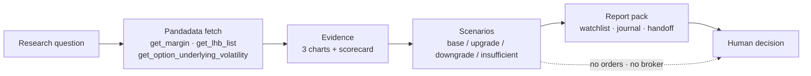

<h1 align="center">Market Regime Monitor</h1>

<p align="center"><a href="README.md">简体中文</a> | <b>English</b></p>

<p align="center">Read Pandadata index, breadth, volatility, and funding evidence to tell whether the market is in heat expansion, risk expansion, or a wait-and-see state.</p>

<p align="center">
  
  
  
  
  
</p>

> This is a QuantSkills Pandadata research and monitoring agent: `agent-market-regime-monitor`. It is built for researchers, traders, and AI-agent-assisted market review workflows, turning real market evidence into **readable, reviewable, and reusable** research materials — it places no orders and issues no unconditional buy/sell instructions.

## What It Helps You Answer

> **Is the market in heat expansion, risk expansion, or a wait-and-see state?**

## Workflow



## When To Use It

- You want to decide whether a market state, risk state, or research lead deserves more attention.
- You want Pandadata evidence turned into a report instead of raw tables only.
- You need a watchlist and review checklist for the next observation window.
- You want to hand the result to another researcher or AI agent.

## Primary Watch Focus

Margin balance, dragon-tiger event-reason distribution, and historical volatility.

## Deliverables

Every run writes a full report pack under `outputs/live/`. Start with the three evidence charts:

<table>
<tr>
<td width="33%" align="center"><br><sub><b>Main evidence</b><br/>Event-reason distribution</sub></td>
<td width="33%" align="center"><br><sub><b>Supporting</b><br/>Margin balance trend</sub></td>
<td width="33%" align="center"><br><sub><b>Scorecard</b><br/>Scorecard metrics</sub></td>
</tr>
</table>

The full output set, grouped by purpose:

| Group | File | Use |
| --- | --- | --- |
| **Core report** | `report.html` | Main report: conclusion, evidence charts, scenarios, invalidation conditions. |
| | `market_regime_brief.md` | Text memo for research notes. |
| | `regime_scorecard.json` | Structured scorecard: per-dimension scores and rationale. |
| | `agent_snapshot.json` | Machine-readable snapshot for other AI agents. |
| **Decision & watch** | `decision_matrix.csv` | Turns base/upgrade/downgrade/insufficient cases into next actions. |
| | `monitoring_checklist.csv` | Prioritized watch items for the next window. |
| | `watch_triggers.md` | Upgrade/downgrade trigger conditions. |
| | `alert_rules.json` | Alert rules a scheduler can read. |
| **Review & handoff** | `research_journal_template.md` | Evidence, counter-evidence, and rerun conditions. |
| | `handoff_card.md` | Short handoff for another researcher or AI agent. |
| | `deliverable_index.md` | Index of all files in this run. |
| | `operator_runbook.md` | How to rerun and how to cross-check. |
| **Data backing** | `breadth_table.csv` | Market breadth evidence table. |
| | `data_dictionary.csv` | Tables, fields, and row counts used. |
| | `scorecard_metrics.csv` | Scorecard metric detail. |
| | `run_summary.json` | Run summary. |

## How To Read The Output

This repository includes a packaged Pandadata live sample under `outputs/live/`:

1. Open `outputs/live/report.html` and read the conclusion plus the questions this agent is suited for.
2. Check the three evidence charts above: main evidence, supporting evidence, and scorecard metrics.
3. Use `decision_matrix.csv` to separate base, upgrade, downgrade, and insufficient-evidence cases.
4. Use `monitoring_checklist.csv` for the next review window.
5. Use `research_journal_template.md` for review notes and `handoff_card.md` for handoff.

## Project Layout

```text
agent-market-regime-monitor/
├── AGENTS.md              Agent definition, workflow, boundaries (multi-runtime entry)
├── agents/openai.yaml     OpenAI / compatible runtime adapter
├── examples/prompt.md     Trigger example
├── references/            Methodology, data & outputs, boundary docs
├── scripts/               run_pandadata_live.py (regenerate) / agent_package.py (validate·summarize)
├── outputs/live/          Sample report pack (report·charts·decision·watch·handoff·data)
├── requirements.txt
└── LICENSE
```

## Quick Start

**Option 1: read the sample output** — clone and open `outputs/live/report.html`.

**Option 2: trigger inside an AI agent**

```text
Use agent-market-regime-monitor to produce a Pandadata-backed market-regime read;
data source Pandadata, stop at any data gap and explain what is missing.
```

**Option 3: regenerate locally with your own Pandadata account**

```powershell
py -3.10 -m pip install -r requirements.txt
Copy-Item .env.example .env   # set PANDADATA_USERNAME / PANDADATA_PASSWORD
py -3.10 scripts/run_pandadata_live.py
py -3.10 scripts/agent_package.py validate
```

The script re-fetches Pandadata data, rebuilds charts, refreshes the watch and handoff materials, and **never writes your credentials into output files**.

Dependency-free utility script:

```powershell
py -3.10 scripts/agent_package.py validate                                   # validate the package
py -3.10 scripts/agent_package.py summarize                                   # print a JSON summary
py -3.10 scripts/agent_package.py summarize --brief outputs/live/generated_brief.md  # write a Markdown brief
```

## Runtime Compatibility

`AGENTS.md` is the single entry point; the agent loads in **Claude Code, Codex, Cursor, and OpenClaw** and other agent-capable runtimes, with `agents/openai.yaml` as an OpenAI-compatible adapter. Data access depends on [`skill-pandadata-api`](https://github.com/quantskills).

## References

- `references/methodology.md`: Agent logic, metric interpretation, and intended use.
- `references/data-and-outputs.md`: Public output files under `outputs/live/` and how to use them.
- `references/agent-boundary.md`: What the agent can and cannot do, and trading boundaries.

## Data Sources

Data comes from Pandadata via:

- `get_margin`
- `get_lhb_list`
- `get_option_underlying_volatility`

## Upgrade And Downgrade Clues

- **Upgrade watch**: margin balance, event heat, and absorption quality keep improving together.
- **Downgrade watch**: heat stays high while margin balance rolls over, volatility rises, or absorption weakens.

## Limitations And Risk Boundaries

- Uses only Pandadata or user-provided data; data gaps are marked "insufficient evidence" rather than filled with assumptions.
- Outputs are research materials, constrained by the data window, interface definitions, and sample range.
- This is a research and monitoring agent, not an automated trading system: it connects to no broker, places no orders, and does not make final trading decisions for the user.

## Disclaimer

This repository only packages research methodology and a monitoring workflow. It validates no return claims and **does not constitute investment advice**. Whether to use any output in real trading must be decided independently by the user, together with their own strategy, risk budget, and execution process.

## Maintainer

Created or maintained by `abgyjaguo`.

## License

GNU General Public License v3.0. See [LICENSE](LICENSE).
