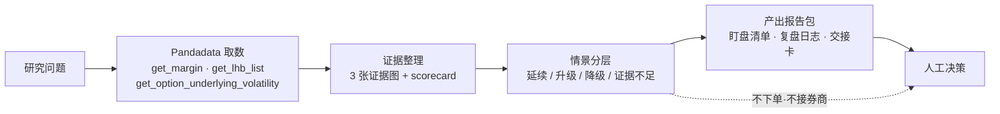
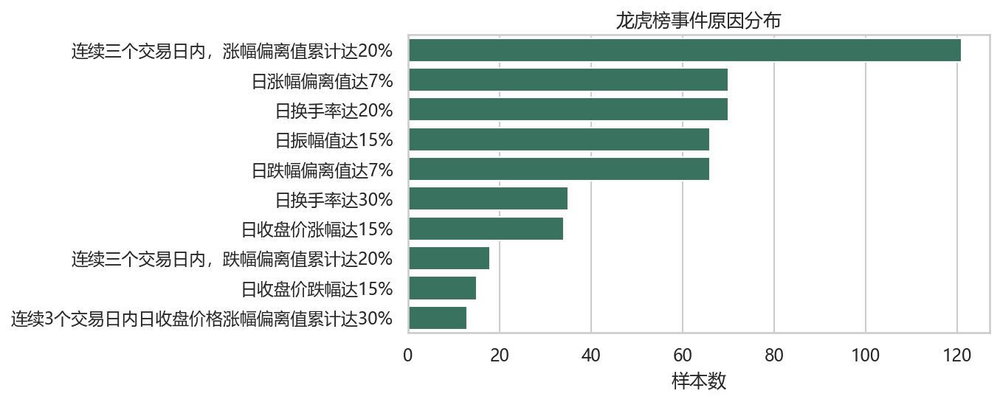
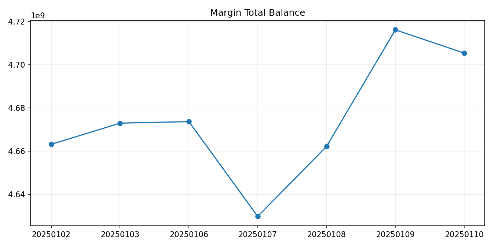
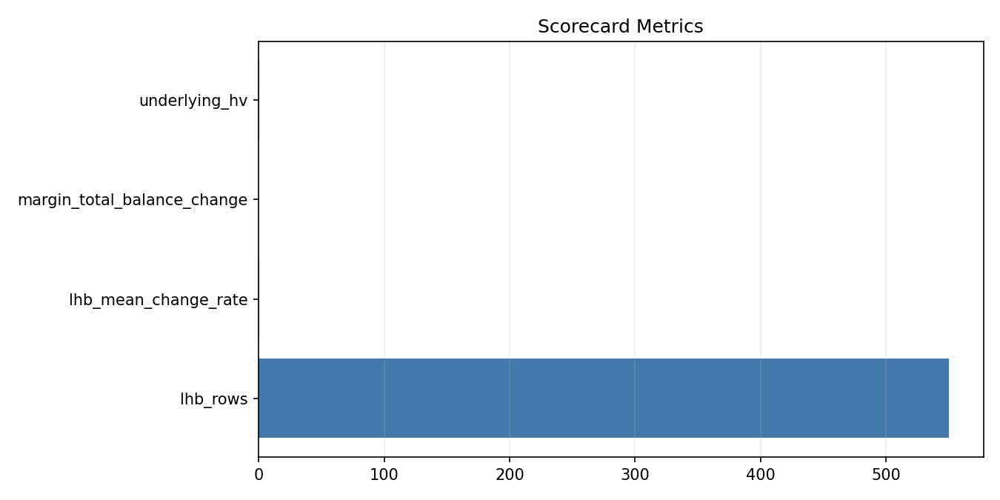

<h1 align="center">市场状态盯盘 Agent</h1>

<p align="center"><b>简体中文</b> | <a href="README.en.md">English</a></p>

<p align="center">用 Pandadata 行情、宽度、波动和资金证据，判断市场处于热度扩张、风险扩张还是需要先观望。</p>

<p align="center">
  
  
  
  
  
</p>

> 这是 QuantSkills 组织的 Pandadata 研究/盯盘 Agent：`agent-market-regime-monitor`。它面向研究员、交易者和用 AI Agent 做市场复盘的用户，把真实市场数据整理成**可阅读、可复盘、可交接**的研究材料 —— 不自动下单，也不输出无条件买卖指令。

## 它帮你回答什么

> **当前市场环境是热度扩张、风险扩张，还是需要先观望？**

## 工作流



## 你什么时候会用它

- 想先判断一个市场状态、风险状态或研究线索是否值得继续看。
- 需要把 Pandadata 数据转成图文报告，而不是只看原始表格。
- 需要给自己或团队留下一份可复盘的观察清单。
- 希望把结果交给另一个研究员或 AI Agent 继续分析。

## 核心观察焦点

融资余额、龙虎榜事件原因分布、历史波动率。

## 产出一览

每次运行都会在 `outputs/live/` 下生成一整套图文报告包。先看三张证据图建立直觉：

<table>
<tr>
<td width="33%" align="center"><br><sub><b>主证据</b><br/>龙虎榜事件原因分布</sub></td>
<td width="33%" align="center"><br><sub><b>辅助证据</b><br/>融资余额走势</sub></td>
<td width="33%" align="center"><br><sub><b>打分卡</b><br/>scorecard 指标</sub></td>
</tr>
</table>

完整产出按用途分组如下：

| 分组 | 文件 | 用途 |
| --- | --- | --- |
| **核心报告** | `report.html` | 图文主报告：结论、证据图、情景推演、反证条件。 |
| | `market_regime_brief.md` | 文字版研判备忘，便于贴进研究日志。 |
| | `regime_scorecard.json` | 结构化打分卡：各维度评分与判断依据。 |
| | `agent_snapshot.json` | 机器可读快照，供其他 AI Agent 直接读取。 |
| **决策与盯盘** | `decision_matrix.csv` | 把延续/升级/降级/证据不足四类情景转成后续动作。 |
| | `monitoring_checklist.csv` | 下一轮盯盘的优先级清单。 |
| | `watch_triggers.md` | 升级/降级触发条件。 |
| | `alert_rules.json` | 可被定时任务读取的预警规则。 |
| **复盘与交接** | `research_journal_template.md` | 记录支持证据、反证证据与重跑条件。 |
| | `handoff_card.md` | 把本次判断交给另一个研究员或 AI Agent。 |
| | `deliverable_index.md` | 产出索引，列出本次所有文件。 |
| | `operator_runbook.md` | 操作手册：如何重跑、如何核对。 |
| **数据底稿** | `breadth_table.csv` | 市场宽度证据表。 |
| | `data_dictionary.csv` | 使用的数据表、字段与行数。 |
| | `scorecard_metrics.csv` | 打分卡指标明细。 |
| | `run_summary.json` | 本次运行摘要。 |

## 如何阅读输出

本仓库已附带一份 Pandadata live 示例输出，位于 `outputs/live/`：

1. 先打开 `outputs/live/report.html`，读核心结论和适合回答的问题。
2. 再看上面三张证据图，确认主判断、辅助证据和 scorecard 指标是否一致。
3. 用 `decision_matrix.csv` 判断当前是延续、升级、降级还是证据不足。
4. 用 `monitoring_checklist.csv` 建立下一轮盯盘清单。
5. 用 `research_journal_template.md` 写复盘，用 `handoff_card.md` 做交接。

## 目录结构

```text
agent-market-regime-monitor/
├── AGENTS.md              Agent 定义、工作流与边界（多运行时入口）
├── agents/openai.yaml     OpenAI / 兼容运行时适配
├── examples/prompt.md     触发示例
├── references/            方法论、数据与产出说明、边界说明
├── scripts/               run_pandadata_live.py（重算）/ agent_package.py（校验·摘要）
├── outputs/live/          示例报告包（报告·证据图·决策·盯盘·交接·数据）
├── requirements.txt
└── LICENSE
```

## 快速开始

**方式一：直接读示例输出** —— 克隆后打开 `outputs/live/report.html` 即可。

**方式二：在 AI Agent 里触发**

```text
用 agent-market-regime-monitor，基于 Pandadata 生成市场状态研判；
数据源 Pandadata，遇到任一数据缺口就停下并说明缺什么。
```

**方式三：用自己的 Pandadata 账号本地重算**

```powershell
py -3.10 -m pip install -r requirements.txt
Copy-Item .env.example .env   # 填入 PANDADATA_USERNAME / PANDADATA_PASSWORD
py -3.10 scripts/run_pandadata_live.py
py -3.10 scripts/agent_package.py validate
```

脚本会重新拉取 Pandadata 数据、重建图表、更新盯盘与交接材料，且**不会把凭据写进任何输出文件**。

辅助工具脚本（无第三方依赖）：

```powershell
py -3.10 scripts/agent_package.py validate                                   # 校验包完整性
py -3.10 scripts/agent_package.py summarize                                   # 输出 JSON 摘要
py -3.10 scripts/agent_package.py summarize --brief outputs/live/generated_brief.md  # 生成 Markdown 简报
```

## 运行时兼容

本 Agent 以 `AGENTS.md` 为统一入口，可在 **Claude Code、Codex、Cursor、OpenClaw** 等支持 Agent 的运行时中加载；`agents/openai.yaml` 提供 OpenAI 兼容适配。数据能力依赖 [`skill-pandadata-api`](https://github.com/quantskills)。

## 参考文档

- `references/methodology.md`：判断逻辑、指标含义和适用场景。
- `references/data-and-outputs.md`：`outputs/live/` 下每个公开产物的用途。
- `references/agent-boundary.md`：Agent 能做什么、不能做什么，以及交易边界。

## 数据来源

数据来自 Pandadata，调用以下接口：

- `get_margin`
- `get_lhb_list`
- `get_option_underlying_volatility`

## 升级与降级线索

- **升级观察**：融资余额、事件热度和承接质量继续同向改善。
- **降级观察**：热度仍高但融资余额回落、波动率升高或承接转弱。

## 限制与风险边界

- 仅使用 Pandadata 或用户提供的数据；数据缺口标记为“证据不足”，不靠假设填补。
- 输出为研究材料，受数据窗口、接口口径和样本范围限制。
- 这是研究和盯盘 Agent，不是自动交易系统：不接券商接口、不执行订单、不替用户做最终交易决定。

## 免责声明

本仓库仅作研究方法与盯盘工作流整理，不验证任何收益声明，**不构成任何投资建议**。是否用于真实交易，需由用户结合自己的策略、风险预算和执行系统独立判断。

## 维护者

Created or maintained by `abgyjaguo`.

## License

GNU General Public License v3.0。详见 [LICENSE](LICENSE)。

## 🐼 PandaAI / QUANTSKILLS 社群

<div align="center">
  
  <br>
  <sub>扫码加入 PandaAI 社群，交流 QUANTSKILLS 技能、Agent 工作流与量化研究实践。</sub>
</div>
